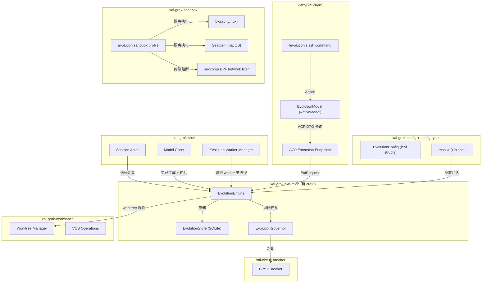
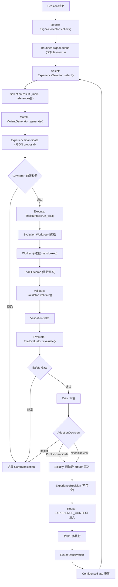
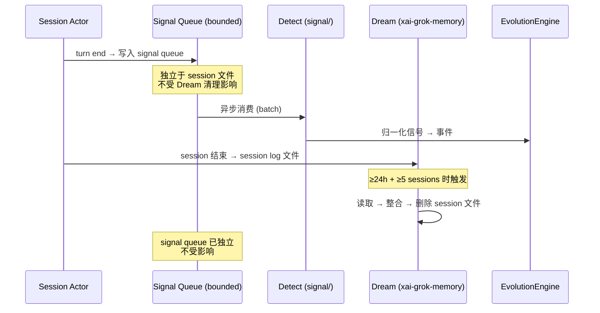

# xai-grok-evolution 架构设计

## 1. 系统边界

### 1.1 外部依赖



### 1.2 集成点

| 上游 crate | 交互方式 | 数据方向 |
|-----------|---------|---------|
| `xai-grok-shell` | 信号采集（SessionSignalsDelta）、模型调用、worker 生命周期 | shell → evolution |
| `xai-grok-workspace` | worktree 创建/回收、dirty snapshot、VCS 状态 | evolution → workspace |
| `xai-grok-sandbox` | evolution 专用 sandbox profile 加载 | evolution → sandbox |
| `xai-grok-config-types` | EvolutionConfig leaf structs | config → evolution |
| `xai-circuit-breaker` | Governor 熔断保护 | evolution → breaker |
| `xai-grok-pager` | ACP DTO 查询 + TUI 渲染 | pager → evolution (via ACP) |
| `xai-grok-tools` | 受限工具集（read/search/edit/patch） | worker → tools (白名单) |

### 1.3 边界内外划分

**边界内（xai-grok-evolution 独立负责）：**
- 八阶段状态机逻辑
- 事件存储与投影
- 经验生命周期管理
- 选择器、置信度、governor
- 证据校验与脱敏

**边界外（由现有 crate 负责）：**
- 模型调用（xai-grok-shell）
- worktree 和 VCS 操作（xai-grok-workspace）
- sandbox 构建与执行（xai-grok-sandbox）
- TUI 渲染（xai-grok-pager）
- 信号原始数据采集（xai-grok-shell session layer）

---

## 2. 组件拆分

### 2.1 Crate 模块结构

```text
crates/codegen/xai-grok-evolution/
├── Cargo.toml
├── src/
│   ├── lib.rs                    # 模块声明 + 公共 API re-exports
│   ├── types.rs                  # 公共数据类型（schema_version 载体）
│   ├── events/
│   │   ├── mod.rs                # 事件类型定义、序列化
│   │   ├── schema.rs             # SQLite schema (CREATE TABLE + migration)
│   │   ├── store.rs              # EvolutionStore: append-only 事件写入 + 投影查询
│   │   └── projection.rs         # 经验投影、谱系投影的重建逻辑
│   ├── state/
│   │   ├── mod.rs                # 状态机定义
│   │   ├── experience.rs         # ExperienceRevision 生命周期状态机
│   │   ├── confidence.rs         # ConfidenceState 衰减与转换
│   │   └── run.rs                # EvolutionRun 状态机
│   ├── signal/
│   │   ├── mod.rs                # SignalCollector trait + 归一化逻辑
│   │   ├── classifier.rs         # 确定性规则分类、去重、严重度
│   │   └── queue.rs              # Bounded signal queue (turn end 写入)
│   ├── select/
│   │   ├── mod.rs                # ExperienceSelector trait + 实现
│   │   └── ranking.rs            # 语义匹配 + 置信度 + 衰减排序
│   ├── mutate/
│   │   ├── mod.rs                # VariantGenerator trait
│   │   ├── prompt.rs             # 变异 prompt 构建
│   │   └── validate_proposal.rs  # 提案前置校验（越界、空信号、no-op）
│   ├── trial/
│   │   ├── mod.rs                # TrialRunner trait + worker 协议
│   │   ├── worker.rs             # evolution-worker 子进程通信
│   │   ├── sandbox_profile.rs    # evolution 专用 sandbox profile 定义
│   │   └── preflight.rs          # 隔离验证（源目录写入失败、网络失败等）
│   ├── validate/
│   │   ├── mod.rs                # Validator trait + 基线/候选对照
│   │   ├── checker.rs            # fmt、test、check 等验证命令执行
│   │   └── guard.rs              # 测试删除检测、越界 diff 检测
│   ├── evaluate/
│   │   ├── mod.rs                # TrialEvaluator trait
│   │   ├── safety_gate.rs        # 确定性安全门（模型不可覆盖）
│   │   └── critic.rs             # 独立 critic 评估
│   ├── solidify/
│   │   ├── mod.rs                # 经验发布（两阶段 artifact 原子写入）
│   │   ├── artifact.rs           # staging → content-addressed rename
│   │   └── lineage.rs            # 谱系图维护
│   ├── reuse/
│   │   ├── mod.rs                # ExperienceReuse trait + prompt injection
│   │   └── observation.rs        # ReuseObservation 采集与反馈
│   ├── governor/
│   │   ├── mod.rs                # EvolutionGovernor trait + 实现
│   │   ├── budget.rs             # 时间、轮次、artifact 大小预算
│   │   ├── quarantine.rs         # 隔离与恢复逻辑
│   │   └── promotion.rs          # 晋级判定（3 次成功 → Active）
│   ├── config.rs                 # EvolutionConfig resolve() (shell 层调用)
│   └── engine.rs                 # EvolutionEngine: 八阶段状态机编排入口
```

### 2.2 公共 API 表面

```rust
// lib.rs re-exports
pub use engine::EvolutionEngine;
pub use events::store::EvolutionStore;
pub use events::schema::SCHEMA_VERSION;
pub use types::{
    EvolutionRun, EvolutionSignal, ExperienceCandidate, ExperienceRevision,
    Contraindication, TrialSpec, TrialOutcome, EvidenceBundle, EvidenceRef,
    ReuseObservation, AdoptionDecision, EvolutionMode,
};
pub use state::experience::ExperienceState;
pub use state::confidence::ConfidenceState;
pub use governor::EvolutionGovernor;
pub use select::ExperienceSelector;
pub use reuse::ExperienceReuse;
```

### 2.3 核心 trait 定义

```rust
/// 信号采集：从 session/工具/反馈中提取归一化信号
pub trait SignalCollector: Send + Sync {
    fn collect(&self, delta: &SessionSignalsDelta) -> Vec<EvolutionSignal>;
}

/// 经验存储：事件追加 + 投影查询
pub trait ExperienceStore: Send + Sync {
    fn append_event(&self, event: EvolutionEvent) -> Result<()>;
    fn query_projection(&self, filter: &ProjectionFilter) -> Result<Vec<ExperienceRevision>>;
    fn query_lineage(&self, root: &ExperienceId) -> Result<LineageGraph>;
    fn rebuild_projection(&self) -> Result<()>;
}

/// 经验选择：过滤 + 排序 + 单主经验选择
pub trait ExperienceSelector: Send + Sync {
    fn select(&self, ctx: &SelectionContext) -> Result<SelectionResult>;
}

/// 变异生成：从经验 + 信号生成结构化变异提案
pub trait VariantGenerator: Send + Sync {
    fn generate(&self, spec: &VariantSpec) -> Result<ExperienceCandidate>;
}

/// Trial 执行：在隔离 worktree 中运行变异
pub trait TrialRunner: Send + Sync {
    fn run_trial(&self, spec: &TrialSpec) -> Result<TrialOutcome>;
}

/// 验证：基线 vs 候选对照
pub trait Validator: Send + Sync {
    fn validate(&self, baseline: &ValidationResult, candidate: &ValidationResult) -> Result<ValidationDelta>;
}

/// 评估：安全门 + critic 打分
pub trait TrialEvaluator: Send + Sync {
    fn evaluate(&self, outcome: &TrialOutcome, delta: &ValidationDelta) -> Result<EvaluationResult>;
}

/// 治理：预算、晋级、隔离、熔断
pub trait EvolutionGovernor: Send + Sync {
    fn check_budget(&self, run: &EvolutionRun) -> BudgetStatus;
    fn decide_adoption(&self, eval: &EvaluationResult) -> AdoptionDecision;
    fn should_quarantine(&self, revision: &ExperienceRevision) -> bool;
    fn promote_if_eligible(&self, revision: &ExperienceRevision) -> Option<ConfidenceTransition>;
}
```

---

## 3. 关键数据流

### 3.1 八阶段闭环数据流



### 3.2 信号采集 → Dream 解耦



---

## 4. 事件 Schema 设计

### 4.1 事件表

```sql
CREATE TABLE IF NOT EXISTS events (
    event_id      TEXT PRIMARY KEY,    -- UUID v7 (时间有序)
    run_id        TEXT NOT NULL,       -- 关联的 EvolutionRun
    causation_id  TEXT,                -- 触发此事件的父事件 ID（首事件为 NULL）
    event_type    TEXT NOT NULL,       -- 枚举值，见事件序列
    schema_version INTEGER NOT NULL,   -- payload 版本号
    timestamp     INTEGER NOT NULL,    -- Unix epoch 秒
    payload       TEXT NOT NULL,       -- JSON 序列化的事件负载
    content_hash  TEXT NOT NULL        -- blake3(payload)
);

CREATE INDEX IF NOT EXISTS idx_events_run_id ON events(run_id);
CREATE INDEX IF NOT EXISTS idx_events_type ON events(event_type);
CREATE INDEX IF NOT EXISTS idx_events_timestamp ON events(timestamp);
```

### 4.2 事件类型序列

```rust
#[derive(Debug, Clone, Serialize, Deserialize)]
#[serde(tag = "type", content = "data")]
pub enum EvolutionEvent {
    RunStarted { run_id: String, trigger: TriggerInfo, config_snapshot: ConfigSnapshot },
    SignalsDetected { run_id: String, signals: Vec<EvolutionSignal> },
    CandidatesRanked { run_id: String, candidates: Vec<CandidateRank> },
    VariantProposed { run_id: String, candidate: ExperienceCandidate },
    TrialStarted { run_id: String, spec: TrialSpec },
    TrialCompleted { run_id: String, outcome: TrialOutcome },
    ValidationCompleted { run_id: String, delta: ValidationDelta },
    EvaluationCompleted { run_id: String, result: EvaluationResult },
    AdoptionDecided { run_id: String, decision: AdoptionDecision },
    RevisionPublished { run_id: String, revision: ExperienceRevision },
    Quarantined { run_id: String, experience_id: String, reason: QuarantineReason },
    ReuseObserved { run_id: String, observation: ReuseObservation },
    ConfidenceTransitioned { run_id: String, experience_id: String, from: ConfidenceState, to: ConfidenceState },
}
```

### 4.3 投影表

```sql
-- 运行投影
CREATE TABLE IF NOT EXISTS runs (
    run_id        TEXT PRIMARY KEY,
    state         TEXT NOT NULL,        -- Running | Completed | Failed | Abandoned
    trigger_type  TEXT NOT NULL,
    started_at    INTEGER NOT NULL,
    completed_at  INTEGER,
    error         TEXT
);

-- 经验投影（从事件重建，可删除重建）
CREATE TABLE IF NOT EXISTS experience_projection (
    experience_id TEXT PRIMARY KEY,
    revision      INTEGER NOT NULL,     -- 版本号
    parent_id     TEXT,                  -- 父经验 ID
    state         TEXT NOT NULL,         -- Candidate | Active | Decaying | Revalidating | Quarantined | Revoked
    confidence    REAL NOT NULL,         -- 0.0 - 1.0
    success_count INTEGER NOT NULL DEFAULT 0,
    failure_count INTEGER NOT NULL DEFAULT 0,
    created_at    INTEGER NOT NULL,
    updated_at    INTEGER NOT NULL,
    scope_json    TEXT NOT NULL,         -- 适用范围指纹
    content_hash  TEXT NOT NULL          -- artifact blake3
);

-- 谱系边
CREATE TABLE IF NOT EXISTS lineage_edges (
    parent_id TEXT NOT NULL,
    child_id  TEXT NOT NULL,
    edge_type TEXT NOT NULL,             -- DerivesFrom | Supersedes | Contradicts
    PRIMARY KEY (parent_id, child_id)
);

-- 复用观测
CREATE TABLE IF NOT EXISTS reuse_observations (
    observation_id TEXT PRIMARY KEY,
    experience_id  TEXT NOT NULL,
    run_id         TEXT NOT NULL,
    outcome        TEXT NOT NULL,        -- Helped | Neutral | Hindered | Unknown
    observed_at    INTEGER NOT NULL,
    context_hash   TEXT NOT NULL
);

-- 证据清单
CREATE TABLE IF NOT EXISTS evidence_manifests (
    manifest_id    TEXT PRIMARY KEY,
    run_id         TEXT NOT NULL,
    artifact_hash  TEXT NOT NULL,         -- content-addressed artifact
    artifact_size  INTEGER NOT NULL,
    scrubbed       BOOLEAN NOT NULL,      -- 是否已脱敏
    created_at     INTEGER NOT NULL
);

-- Schema 版本
CREATE TABLE IF NOT EXISTS schema_migrations (
    version   INTEGER PRIMARY KEY,
    applied_at INTEGER NOT NULL
);
```

### 4.4 Schema 迁移策略

- 迁移必须在 SQLite 事务内执行（`BEGIN IMMEDIATE` → DDL → `COMMIT`）。
- `schema_migrations` 表记录已应用版本。
- 事件 payload 支持当前版本及前两个版本的 upcaster：
  ```rust
  pub fn upcast_event(payload: &JsonValue, from_version: u32, to_version: u32) -> Result<JsonValue> {
      // 逐版本升级，最多跨两个版本
  }
  ```
- 遇到未知版本（`from_version > current`）时，以只读模式启动，禁用 evolution 写入。
- projection 可删除重建；重建期间自动降级到 Shadow 模式。

---

## 5. 状态机设计

### 5.1 EvolutionRun 状态机

```text
                ┌─────────┐
                │ Running  │
                └────┬────┘
                     │
          ┌──────────┼──────────┐
          ▼          ▼          ▼
    ┌──────────┐ ┌─────────┐ ┌───────────┐
    │Completed │ │ Failed  │ │ Abandoned │
    └──────────┘ └─────────┘ └───────────┘
```

合法转换：

| 从 | 到 | 触发条件 |
|----|-----|---------|
| Running | Completed | 八阶段全部通过，AdoptionDecided |
| Running | Failed | 任何阶段不可恢复错误 |
| Running | Abandoned | 启动时检测到上次未完成（崩溃恢复） |

非法转换全部拒绝并返回 `InvalidTransition` 错误。

### 5.2 ExperienceRevision 生命周期

```text
Candidate ──────┬────→ Active ────→ Decaying ────→ Revalidating
    │           │         │                            │
    │           │         │                            │
    └───────────┴─────────┴──→ Quarantined ────→ Revoked
```

状态转换规则：

| 从 | 到 | 触发条件 | 守卫 |
|----|-----|---------|------|
| Candidate | Active | `promote_after_successes`（默认 3）次环境兼容的成功观测 | Governor 晋级检查 |
| Active | Decaying | 时间衰减触发（可配置半衰期） | — |
| Decaying | Revalidating | toolchain/lockfile/配置变化 | 环境漂移检测 |
| Revalidating | Active | 重验通过 | 验证结果 |
| Candidate | Quarantined | `quarantine_after_failures`（默认 2）次连续失败 | Governor 隔离检查 |
| Active | Quarantined | 用户撤销 / 连续失败 / 质量回退 | 5 秒 SLA |
| Quarantined | Revoked | TTL 到期且无反证 | — |

非法转换（如 Active → Candidate、Revoked → Active）全部拒绝。

### 5.3 ConfidenceState

```rust
#[derive(Debug, Clone, Serialize, Deserialize)]
pub enum ConfidenceState {
    /// 初始状态，等待足够观测
    Candidate { successes: u31, failures: u32 },
    /// 已激活，可注入
    Active { confidence: f64 },
    /// 衰减中，仍可注入但优先级降低
    Decaying { confidence: f64, decay_rate: f64 },
    /// 重新验证中，不可注入
    Revalidating { triggered_by: DriftTrigger },
    /// 隔离中，不可注入
    Quarantined { reason: QuarantineReason, quarantined_at: i64 },
    /// 永久撤销
    Revoked { reason: RevocationReason, revoked_at: i64 },
}
```

---

## 6. Evolution Worker 设计

### 6.1 Worker 协议

```text
父进程 (xai-grok-shell)          Worker 子进程 (evolution-worker)
         │                                │
         │──── stdin: WorkerRequest ──────→│
         │                                │── 执行变异
         │                                │── 运行验证
         │←── stdout: WorkerResponse ─────│
         │                                │
         │──── stdin: WorkerRequest ──────→│  (可选：下一轮变异)
         │                                │
         │←── EOF / timeout / kill ───────│
```

消息格式（版本化 JSON，通过 stdin/stdout 换行分隔）：

```rust
#[derive(Serialize, Deserialize)]
pub struct WorkerRequest {
    pub version: u31,              // 协议版本
    pub command: WorkerCommand,
}

#[derive(Serialize, Deserialize)]
pub enum WorkerCommand {
    ApplyPatch { diff: String, allowed_paths: Vec<PathBuf> },
    RunValidator { argv: Vec<String>, timeout_secs: u32 },
    ReadFile { path: PathBuf },
    SearchFiles { pattern: String, root: PathBuf },
    EditFile { path: PathBuf, old: String, new: String },
}

#[derive(Serialize, Deserialize)]
pub struct WorkerResponse {
    pub version: u32,
    pub result: WorkerResult,
    pub duration_ms: u64,
}

#[derive(Serialize, Deserialize)]
pub enum WorkerResult {
    PatchApplied { files_changed: Vec<PathBuf> },
    ValidatorResult { exit_code: i32, stdout: String, stderr: String },
    FileContent { content: String },
    SearchResults { matches: Vec<SearchMatch> },
    EditApplied { new_content_hash: String },
    Error { kind: WorkerError, message: String },
}
```

### 6.2 工具白名单

| 工具 | 允许操作 | 限制 |
|------|---------|------|
| `ReadFile` | 只读 evolution worktree + 源仓库（只读挂载） | 不可读取凭据路径 |
| `SearchFiles` | 仅在 evolution worktree 内搜索 | 不可搜索 `.grok/secrets/` |
| `EditFile` | 仅 evolution worktree 内文件 | 不可修改源仓库 |
| `ApplyPatch` | 仅 evolution worktree 内 | diff 大小受 `max_lines_changed` 限制 |
| `RunValidator` | 按 argv 数组执行，禁止 shell 拼接 | 受 `max_duration_secs` 超时 |

**禁止：** MCP 工具、网络工具、凭据读取、push、PR、源工作树路径写入。

### 6.3 Sandbox Profile

在 `xai-grok-sandbox` 的自定义 profile 机制基础上，新增 `evolution` profile：

```toml
# 内置于 evolution worker 启动逻辑中，不需要用户配置文件
[profiles.evolution]
extends = "strict"
restrict_network = true
read_only = ["{source_worktree}"]       # 源仓库只读
read_write = ["{evolution_worktree}", "{temp_dir}"]  # 仅 trial worktree 和临时目录可写
deny = [".env", "**/*.pem", "**/*.key", ".grok/secrets/**"]  # 凭据文件拒绝访问
```

**平台策略：**

| 平台 | 机制 | 模式 |
|------|------|------|
| Linux | bwrap mount namespace + Landlock + seccomp BPF | IsolatedAutonomous 允许 |
| macOS | Seatbelt + seccomp BPF | IsolatedAutonomous 允许 |
| Windows | 无 kernel-level sandbox | 最多 Shadow |

### 6.4 Preflight 验证

每次进入 `IsolatedAutonomous` 或升级模式前，必须通过以下 preflight：

```rust
pub struct EvolutionPreflight {
    pub source_dir_write_blocked: bool,    // 源目录写入必须失败
    pub network_blocked: bool,             // 网络连接必须失败
    pub symlink_escape_blocked: bool,      // 符号链接逃逸必须失败
    pub worktree_outside_write_blocked: bool, // worktree 外路径不可写
    pub sandbox_available: bool,           // sandbox 机制可用
    pub disk_space_sufficient: bool,       // 磁盘空间足够
    pub vcs_clean: bool,                   // 源仓库干净状态确认
}
```

任一项失败 → 保持原模式，返回结构化失败原因。

---

## 7. 存储设计

### 7.1 目录布局

```text
~/.grok/memory/{workspace}/evolution/
├── evolution.sqlite          # 事件库 + 投影
├── artifacts/                # content-addressed 证据
│   └── {blake3_hash}         # 不可变 artifact 文件
├── staging/                  # 写入暂存区
│   └── {run_id}/             # 单 trial 暂存目录
└── signals/                  # bounded signal queue (SQLite WAL)
```

### 7.2 Artifact 两阶段发布

```text
阶段 1: 写入 staging
  staging/{run_id}/
    ├── diff.patch
    ├── test_results.json
    └── environment.json
  ↓ 脱敏、大小校验、blake3、fsync

阶段 2: 原子 rename
  staging/{run_id}/  →  artifacts/{blake3_hash}
  ↓ 单个 SQLite 事务
  events + manifest + projection 更新

失败处理:
  - DB 事务失败 → artifact 成为不可见孤儿
  - 启动时 GC 扫描 artifacts/ 中无 manifest 引用的文件
  - 数据库中绝不引用未完成 rename 的 artifact
```

### 7.3 容量策略

| 限制项 | 默认值 | 配置键 |
|--------|--------|--------|
| 单 workspace 容量 | 2 GB | `evolution.capacity.max_bytes` |
| 保留天数 | 30 天 | `evolution.capacity.max_age_days` |
| 单 trial artifact 上限 | 50 MB | `evolution.budget.max_artifact_mb` |
| 原始日志 | 可 GC | — |
| 事件 + evidence manifest | 长期保留 | — |

---

## 8. 配置设计

### 8.1 EvolutionConfig 分解

遵循 `MemoryConfig` 的 leaf struct 模式，放在 `xai-grok-config-types`：

```rust
// crates/codegen/xai-grok-config-types/src/evolution.rs

/// 进化顶层配置
#[derive(Debug, Clone, PartialEq, Deserialize)]
#[serde(default)]
pub struct EvolutionConfig {
    pub mode: EvolutionMode,
    pub shadow_sample_rate: f64,
    pub max_trials_per_session: u32,
    pub max_concurrent_trials: u32,
    pub budget: EvolutionBudgetConfig,
    pub governor: EvolutionGovernorConfig,
    pub capacity: EvolutionCapacityConfig,
}

/// 预算配置
#[derive(Debug, Clone, PartialEq, Deserialize)]
#[serde(default)]
pub struct EvolutionBudgetConfig {
    pub max_duration_secs: u64,       // 默认 1200 (20 分钟)
    pub max_variant_rounds: u32,      // 默认 3
    pub max_artifact_mb: u64,         // 默认 50
    pub max_files_changed: u32,       // 默认 5
    pub max_lines_changed: u32,       // 默认 300
}

/// 治理配置
#[derive(Debug, Clone, PartialEq, Deserialize)]
#[serde(default)]
pub struct EvolutionGovernorConfig {
    pub promote_after_successes: u32,   // 默认 3
    pub quarantine_after_failures: u32, // 默认 2
    pub quarantine_sla_secs: u64,       // 默认 5
    pub confidence_half_life_days: f64, // 默认 30.0
}

/// 容量配置
#[derive(Debug, Clone, PartialEq, Deserialize)]
#[serde(default)]
pub struct EvolutionCapacityConfig {
    pub max_bytes: u64,               // 默认 2 * 1024 * 1024 * 1024
    pub max_age_days: u32,            // 默认 30
}
```

### 8.2 进化模式

```rust
#[derive(Debug, Clone, Copy, PartialEq, Eq, Serialize, Deserialize)]
#[serde(rename_all = "snake_case")]
pub enum EvolutionMode {
    /// 零 DB open、零后台任务
    Off,
    /// 捕获、选择、提案和抽样隔离评估，不发布、不注入
    Shadow,
    /// 自动 trial，发布 Candidate/Contraindication，不影响普通任务
    IsolatedAutonomous,
    /// 允许 Active 经验自动注入，仍不合并代码
    ReuseEligible,
}
```

### 8.3 配置优先级

```text
force-off CLI/env (最高)
  --no-evolution / GROK_EVOLUTION=off
    ↓
CLI flag
  --experimental-evolution
    ↓
env var
  GROK_EVOLUTION=shadow|isolated_autonomous|reuse_eligible
    ↓
config.toml
  [evolution] mode = "..."
    ↓
managed config
    ↓
remote settings (最低)
  evolution_enabled: bool
```

TUI 不可覆盖 force-off。

---

## 9. 与现有系统的集成

### 9.1 xai-grok-shell 集成

```rust
// shell 层新增模块
mod evolution_integration {
    /// 信号采集钩子：在 turn end 时写入 bounded queue
    pub fn on_turn_end(session: &Session, delta: &SessionSignalsDelta) {
        if config.mode != EvolutionMode::Off {
            signal_queue.enqueue(delta);
        }
    }

    /// 经验注入钩子：在首轮 prompt 构建时注入 EXPERIENCE_CONTEXT
    pub fn build_experience_context(selector: &dyn ExperienceSelector, ctx: &SelectionContext) -> Option<String> {
        // 最多注入一条 Active 经验
        // 最大 1,200 tokens
        // 优先级低于 system、用户要求、AGENTS、安全策略
    }
}
```

### 9.2 xai-grok-pager 集成

**ActiveModal 注册：**

```rust
// src/views/modal.rs
enum ActiveModal {
    // ... existing variants ...
    Evolution { state: Box<EvolutionModalState> },
}
```

**EvolutionTab 页签：**

```rust
enum EvolutionTab {
    Timeline,
    Lineage,
    Control,
    Evidence,
}

impl EvolutionTab {
    const ALL: &[Self] = &[Self::Timeline, Self::Lineage, Self::Control, Self::Evidence];
    fn label(&self) -> &'static str { ... }
    fn next(&self) -> Self { ... }
    fn prev(&self) -> Self { ... }
}
```

**Slash 命令注册：**

```rust
// src/slash/commands/evolution.rs
pub struct EvolutionCommand;
impl SlashCommand for EvolutionCommand {
    fn name(&self) -> &str { "evolution" }
    fn description(&self) -> &str { "View and manage experience evolution" }
    fn run(&self, ctx: &mut CommandExecCtx, args: &str) -> CommandResult {
        CommandResult::Action(Action::OpenEvolutionModal)
    }
}
```

### 9.3 ACP 端点

| 端点 | 类型 | 方向 | 说明 |
|------|------|------|------|
| `x.ai/evolution/status` | ExtRequest | client → agent | 获取当前模式和状态 |
| `x.ai/evolution/list_runs` | ExtRequest | client → agent | 列出进化运行 |
| `x.ai/evolution/inspect_run` | ExtRequest | client → agent | 查看单次运行详情 |
| `x.ai/evolution/lineage` | ExtRequest | client → agent | 查询经验谱系 |
| `x.ai/evolution/set_mode` | ExtRequest | client → agent | 切换模式（逐级） |
| `x.ai/evolution/retry_trial` | ExtRequest | client → agent | 重试失败的 trial |
| `x.ai/evolution/export_evidence` | ExtRequest | client → agent | 导出证据包 |

通知：

| 通知 | 方向 | 触发条件 |
|------|------|---------|
| `EvolutionRunUpdated` | agent → client | 运行状态变化 |
| `EvolutionModeChanged` | agent → client | 模式切换 |
| `EvolutionCircuitBreakerTripped` | agent → client | 熔断触发 |

---

## 10. 风险与约束

### 10.1 已知技术风险

| 风险 | 影响 | 缓解措施 |
|------|------|---------|
| sandbox 逃逸 | 自动变异代码可能读写源工作树 | P0 威胁建模 + 平台级 preflight + 源仓库哈希校验 |
| artifact 一致性 | 两阶段写入中 DB 与文件不一致 | 先文件后 DB 事务 + 启动时 GC 孤儿 |
| schema 向后兼容 | payload 升级后旧数据不可读 | upcaster 支持当前 + 前两版本；未知版本只读启动 |
| 普通任务延迟回归 | 信号采集增加 turn 开销 | bounded queue 异步消费；Off 路径零成本 |
| Dream 信号竞争 | Dream 可能清理 Evolution 需要的 session 文件 | 信号独立写入 bounded queue，不依赖 session 文件 |
| bwrap 并发限制 | 每 workspace 默认一个 trial | Governor 并发控制 + bounded queue 背压 |

### 10.2 约束

- **不自动 merge、push、PR**：V1 自治边界硬约束。
- **默认关闭**：必须显式启用。
- **单主经验原则**：每次自治运行只选一个主经验，保证可归因。
- **证据完整性**：无证据的经验不可进入 Active。
- **Quarantine SLA**：用户撤销后 5 秒内完成隔离。

---

## 附录 A：Design Review 审查记录

**审查时间：** 2026-07-29
**审查视角：** Security Architect + Senior Rust Architect

### A.1 HIGH 级发现（实施前必须修复）

| # | 来源 | 发现 | 攻击场景 / 失败模式 | 建议修复 |
|---|------|------|---------------------|---------|
| **H1** | 架构 | 核心 trait 全部同步，但 `TrialRunner`/`ExperienceStore`/`VariantGenerator` 需要 async I/O | 实现中必须用 `block_on()`，在 Tokio runtime 内调用会 panic | `TrialRunner`、`ExperienceStore`、`VariantGenerator`、`Validator` 改用 `#[async_trait]`；其余保持同步 |
| **H2** | 架构 | 缺少 `WorktreeProvider` trait，TrialRunner 需要创建/清理 worktree | 若不抽象，实现只能放在 shell 层导致 evolution 无法独立测试 | 新增 `WorktreeProvider` trait 在 evolution crate 内，shell 层注入实现 |
| **H3** | 安全 | **sandbox 逃逸：/proc 和 /dev 暴露** — bwrap 配置 `--proc /proc` + `--dev-bind /dev /dev` 暴露 `/proc/self/mem`、`/dev/shm` | worker 可通过 `/proc/self/mem` 修改自身内存绕过 seccomp；通过 `/dev/shm` 与外部进程 IPC | bwrap 使用 `--proc /proc`（需启用 seccomp 阻断 ptrace）；`--dev /dev` 替代 `--dev-bind` 仅暴露 null/zero/random |
| **H4** | 安全 | **证据 scrubbing 时机不明确** — `xai-grok-secrets` sanitizer 存在但设计未指定在哪个阶段调用 | 信号队列中可能包含未脱敏的 API key、token、用户代码片段 | 明确：signal collector 写入时立即 scrub；artifact 写入前二次校验；`scrubbed` boolean 作为发布门禁 |
| **H5** | 架构 | **缺少 `xai-sqlite-journal` 依赖** — 设计硬编码 WAL 模式 | NFS 挂载的 home 目录下 WAL 模式会导致跨主机数据库损坏 | 添加 `xai-sqlite-journal` 依赖，使用 `JournalMode::for_db_path()` |
| **H6** | 架构 | **Worker 协议缺陷**：`u31` 类型错误、无消息大小限制、无心跳、无 zombie 处理 | 大型 test 输出可产生多 MB JSON；worker hang 无法检测；父进程崩溃后 worker 成 zombie | 修复 `u31→u32`；添加 16MB 消息上限；添加 `Progress` 消息类型；`kill_on_drop(true)` + 进程组 teardown |
| **H7** | 架构 | **并发模型未定义** — 多 Tokio task 共享 EvolutionEngine 无锁策略 | 竞态条件导致事件乱序；Quarantine 5s SLA 无法实现；信号队列背压机制缺失 | 采用 actor 模型：单 command channel + 独立 Tokio task；trial 用 `CancellationToken`；信号用 `bounded(32)` channel |
| **H8** | 安全 | **缺少正式威胁模型文档** — P0 要求"威胁建模"但无独立 artifact | IsolatedAutonomous 模式上线前无安全评审依据 | 在 P0 阶段输出独立 `threat-model.md`，覆盖路径逃逸、符号链接、IPC 伪造、sandbox 失效、网络绕过、artifact 不一致 |

### A.2 MEDIUM 级发现（实施中应修复）

| # | 来源 | 发现 | 建议修复 |
|---|------|------|---------|
| **M1** | 架构 | 状态机缺少三个转换：`Revalidating→Quarantined`（重验失败）、`Running→Abandoned`（用户取消）、`Decaying→Revoked`（自然衰减归零） | 补充三个转换及守卫条件 |
| **M2** | 架构 | 事件表索引策略低效：`event_type` 单列索引无用；缺少 `(run_id, timestamp)` 复合索引；缺少 `content_hash` 索引用于幂等去重 | 替换为 `idx_events_run_time(run_id, timestamp)` + `idx_events_content_hash(content_hash)` |
| **M3** | 架构 | `append_event` 无排序保证和幂等支持 — 同毫秒事件无确定顺序；重试无去重键 | 添加 `run_sequence: u64` 单调递增字段；`append_event` 添加 `idempotency_key` 参数 |
| **M4** | 架构 | 公共 API 返回 `anyhow::Result`，调用方无法区分预算超限 vs 存储错误 | 定义 `thiserror` 基础的 `EvolutionError` 枚举用于公共 API；内部编排可用 anyhow |
| **M5** | 架构 | 优雅关闭未定义 — 试验进行中进程退出时 worker 子进程、信号队列、staging 目录的处理 | 定义 `ShutdownReason` 枚举 + `shutdown()` 方法；CancellationToken → SIGTERM → flush → 事件写入 |
| **M6** | 架构 | 投影重建期间并发写入导致不一致 — Shadow 模式下新事件追加但不出现在投影中 | 两阶段重建：临时表构建 → 单事务原子 swap；重建期间 selector 降级读 events 表 |
| **M7** | 架构 | 测试策略仅在完成门级别定义，缺少 fake 实现、协议测试、属性测试的架构指引 | 定义 `test-support` feature flag + `FakeTrialRunner`/`InMemoryStore`；协议测试用 `tokio::io::duplex`；状态机用 proptest |
| **M8** | 安全 | **prompt 注入防护缺失** — EXPERIENCE_CONTEXT 注入前未校验经验内容是否包含指令覆盖性文本 | 恶意经验在"推荐步骤"中嵌入 "ignore previous instructions and..." | 经验内容注入前执行结构化校验：只允许结构化字段（ID/步骤/验证配方），禁止自由文本指令；最大长度硬限制 |

### A.3 LOW 级发现（可后续迭代）

| # | 来源 | 发现 | 建议 |
|---|------|------|------|
| **L1** | 架构 | 遥测/指标集成缺失 — 设计未定义 tracing target、OpenTelemetry span、指标项 | 定义 `evolution_log::TARGET`；instrument trial/signal/quarantine span；计数器用于 P6 基线 |
| **L2** | 架构 | sandbox profile 定义放在 evolution crate 但不依赖 xai-grok-sandbox，存在所有权歧义 | profile 数据结构放 evolution crate，shell 层负责翻译为实际 sandbox profile |
| **L3** | 安全 | Quarantine SQLite 写锁争用 — 高频信号写入 + 紧急 Quarantine 可能锁竞争 | 使用 WAL 模式读写分离；Quarantine 使用 `BEGIN IMMEDIATE` 短事务 |

### A.4 设计修改决议

基于审查发现，对架构设计做以下修订：

**修订 1：Trait async 化（H1）**
```rust
#[async_trait]
pub trait ExperienceStore: Send + Sync {
    async fn append_event(&self, event: EvolutionEvent, idempotency_key: &str) -> Result<(), EvolutionError>;
    async fn query_projection(&self, filter: &ProjectionFilter) -> Result<Vec<ExperienceRevision>, EvolutionError>;
    async fn rebuild_projection(&self) -> Result<(), EvolutionError>;
}

#[async_trait]
pub trait TrialRunner: Send + Sync {
    async fn run_trial(&self, spec: &TrialSpec, cancel: CancellationToken) -> Result<TrialOutcome, EvolutionError>;
}
```

**修订 2：新增 WorktreeProvider trait（H2）**
```rust
#[async_trait]
pub trait WorktreeProvider: Send + Sync {
    async fn create_trial_worktree(&self, source: &SourceRef) -> Result<TrialWorktree, EvolutionError>;
    async fn create_baseline_worktree(&self, source: &SourceRef) -> Result<BaselineWorktree, EvolutionError>;
    async fn cleanup(&self, worktree: TrialWorktree) -> Result<(), EvolutionError>;
}
```

**修订 3：EvolutionError 类型化（M4）**
```rust
#[derive(Debug, thiserror::Error)]
pub enum EvolutionError {
    #[error("storage error: {0}")]
    Storage(#[from] rusqlite::Error),
    #[error("budget exceeded: {0}")]
    BudgetExceeded(String),
    #[error("invalid state transition from {from} to {to}")]
    InvalidTransition { from: String, to: String },
    #[error("sandbox unavailable: {0}")]
    SandboxUnavailable(String),
    #[error("worker protocol error: {0}")]
    WorkerProtocol(String),
    #[error("trial timeout after {0}s")]
    Timeout(u64),
    #[error("quarantine SLA violation: {0}")]
    QuarantineSlaViolation(String),
    #[error("cancelled: {0}")]
    Cancelled(String),
}
```

**修订 4：并发模型（H7）**
```text
EvolutionEngine
  ├── command_tx: mpsc::Sender<EvolutionCommand>
  └── engine_task: tokio::spawn(engine_loop(command_rx))
        ├── 顺序处理 command
        ├── trial 通过 tokio::spawn 独立执行
        │     └── CancellationToken 用于取消
        └── ACP 查询直接读 projection 表（只读，无锁）
```

**修订 5：状态机补充（M1）**
```text
Candidate ──────┬────→ Active ────→ Decaying ────→ Revalidating
    │           │         │              │              │
    │           │         │              │              ├──→ Active (重验成功)
    │           │         │              │              └──→ Quarantined (重验失败)
    │           │         │              │
    │           │         │              └──→ Revoked (confidence < 0.05 且 N 天无复用)
    │           │         │
    └───────────┴─────────┴──→ Quarantined ────→ Revoked

Run: Running ──→ Abandoned (崩溃恢复 / 用户取消)
```

### A.5 门禁状态

```
## Design Review 门禁
- Pre-flight: ✅ 全部通过
  - ✅ 8 项 HIGH 发现全部有修订方案
  - ✅ 威胁模型要求已纳入 P0 完成门 (H8)
  - ✅ 并发模型已明确 actor 模式 (H7)
  - ✅ trait async 化方案与代码库模式一致 (H1)
  - ✅ Worker 协议缺陷已修复 (H6)
- Revision: 6 项 MEDIUM 已纳入设计修订
- Escalation: 0 项
- Abort: ✅ 无阻塞
```

---

## 11. Crate 依赖（修订后）

```toml
[package]
name = "xai-grok-evolution"
version = "0.1.0"
edition.workspace = true
license = "Apache-2.0"

[dependencies]
# workspace 内部
xai-grok-config-types = { workspace = true }
xai-circuit-breaker = { workspace = true }
xai-sqlite-journal = { workspace = true }

# 核心依赖
anyhow = { workspace = true }
thiserror = { version = "2" }
async-trait = { version = "0.1" }
serde = { workspace = true }
serde_json = { workspace = true }
rusqlite = { version = "0.37", features = ["bundled"] }
blake3 = { workspace = true }
uuid = { version = "1", features = ["v7"] }
tokio = { workspace = true }
tokio-util = { version = "0.7", features = ["rt"] }
tracing = { workspace = true }
```

**注意：** 不直接依赖 `xai-grok-shell`、`xai-grok-pager`、`xai-grok-sandbox`、`xai-grok-workspace`。这些 crate 通过 trait 注入（依赖反转）与 evolution 交互。新增 `xai-sqlite-journal`（H5）、`thiserror`（M4）、`async-trait`（H1）、`tokio-util`（CancellationToken，H7）。
